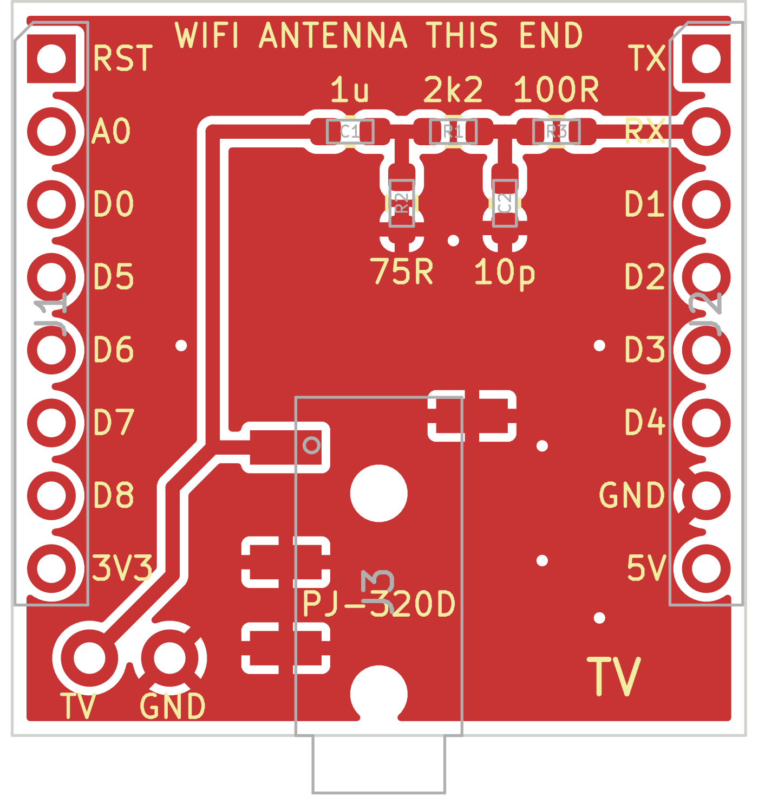

# TV shield for the Wemos D1 Mini, surface-mount

The same circuit and the same size as [the through-hole board](../tv-shield/), drawn with parts that an assembly service places by machine. Use this one to ask for a price for finished boards. If you solder them yourself, the through-hole board is the easier one.



**This board has not been made or built yet.** It passed KiCad's design rule check. Read [what to check](#what-to-check) before you order more than a few.

## The circuit

```
RX ──[ R3 100R ]──┬──[ R1 2k2 ]──┬──[ C1 1u ]────── TV, tip of the plug
                  │              │
               C2 10p         [ R2 75R ]
                  │              │
GND ──────────────┴──────────────┴───────────────── TV, sleeve of the plug
```

What each part is for is in the [README of the through-hole board](../tv-shield/README.md#the-circuit). C1 is 1 µF, the value this circuit was tried with. Here it is a ceramic one, which has no plus and minus side.

## Parts

All of them were looked up in the parts list of JLCPCB. Stock and price were not.

| Part | Value | Size | LCSC number | Kind there |
|---|---|---|---|---|
| R3 | 100 Ω | 0603 | C22775 | basic |
| R1 | 2.2 kΩ | 0603 | C4190 | basic |
| R2 | 75 Ω | 0603 | C4275 | basic |
| C2 | 10 pF | 0603 | C1634 | basic |
| C1 | 1 µF | 0603 | C15849 | basic |
| J3 | 3.5 mm socket PJ-320D | | C431535 | extended |

JLCPCB charges a fee once per order for every kind of extended part. Here that is only the socket.

**The pin rows are not placed** and are in neither list. They are through-hole, which way round they go depends on how you stack the boards, and a D1 Mini comes with pins. You solder those 16 joints yourself.

**The two holes at the bottom left** take a cable that is soldered on, the inner wire to `TV` and the shield to `GND`. With them the board works without the socket.

## Files

| File | What it is |
|---|---|
| [tv-shield-smd-gerbers.zip](tv-shield-smd-gerbers.zip) | The board: copper, solder mask, printing, solder paste for the top, outline, holes. Two layers, 1.6 mm. |
| [tv-shield-smd-bom.csv](tv-shield-smd-bom.csv) | The parts, with the column names JLCPCB reads. |
| [tv-shield-smd-positions.csv](tv-shield-smd-positions.csv) | Where each part goes and how it is turned. |

## What to check

- **The contacts of the socket.** Which pad is the tip comes from the PJ-320D part in KiCad's library. It was not checked against a real socket. On the first board, put a plug in and measure: the tip of the plug has to reach the `TV` hole, and its sleeve the `GND` hole.
- **How the parts are turned.** Every service counts the angle of a part its own way. Look at the preview they show after the upload, the socket most of all: its opening has to be at the edge of the board.
- **The socket has four contacts**, for a plug with tip, two rings and sleeve. Only the tip carries the signal here, the other three are ground. A plug with two or three contacts fits and works the same.

## Which way round

As on the through-hole board: the line `WIFI ANTENNA THIS END` goes over the antenna of the D1 Mini, and the socket points the same way as the USB socket.

## Changing it

The board is drawn by [make_board.py](make_board.py), all positions and the parts list are in it. It needs the Python that comes with KiCad 9. Without KiCad installed, the container does it:

```sh
docker run --rm --platform linux/amd64 -v "$PWD":/work -w /work kicad/kicad:9.0 sh -c '
  python3 make_board.py tv-shield-smd.kicad_pcb &&
  kicad-cli pcb drc --severity-all --exit-code-violations tv-shield-smd.kicad_pcb &&
  kicad-cli pcb export gerbers --layers F.Cu,B.Cu,F.SilkS,B.SilkS,F.Mask,B.Mask,F.Paste,Edge.Cuts --subtract-soldermask -o gerbers/ tv-shield-smd.kicad_pcb &&
  kicad-cli pcb export drill --format excellon --excellon-units mm -o gerbers/ tv-shield-smd.kicad_pcb'
```
