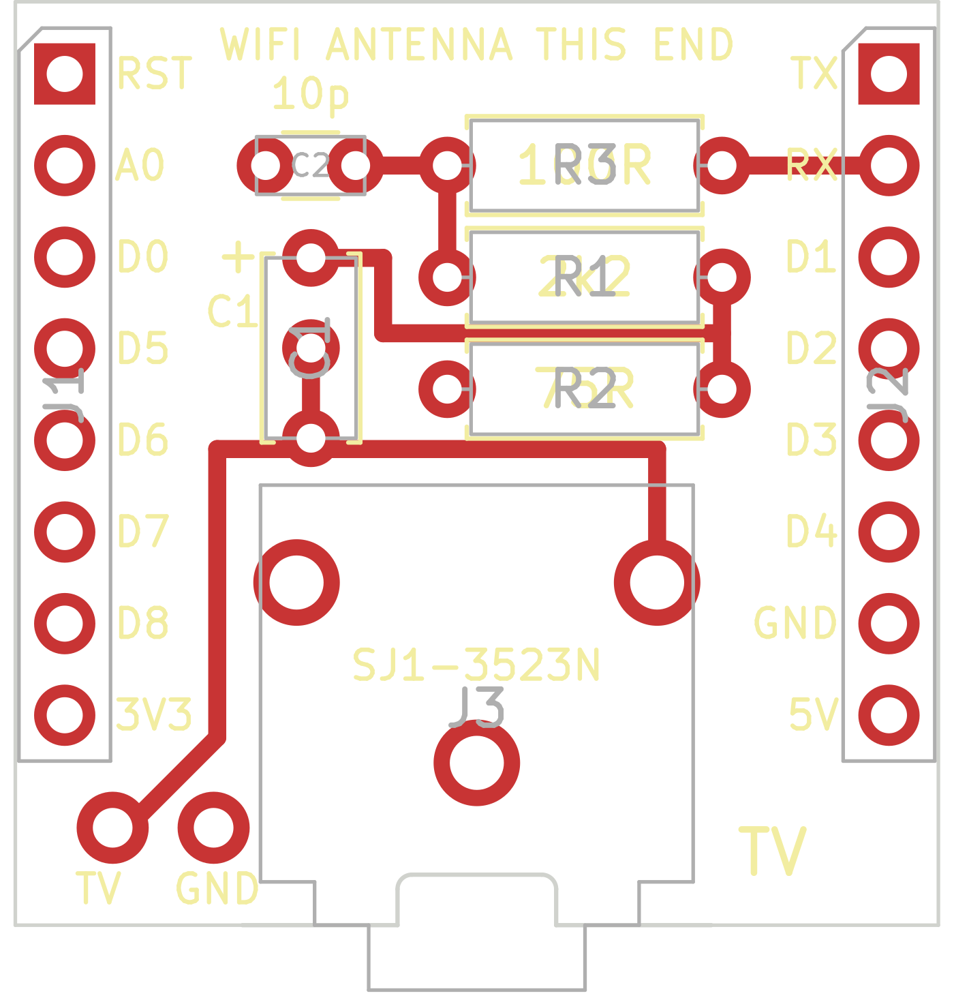

# TV shield for the Wemos D1 Mini

A small board that sits on a Wemos D1 Mini and feeds the TV signal into the antenna socket of a TV by cable, instead of radiating it from a wire. It is 25.6 mm square, as wide as the D1 Mini, and has the same two rows of eight pins.



**This board has not been made or built yet.** The circuit on it is the one that works here with loose parts. The board itself passed KiCad's design rule check, and its pin order was compared with the D1 Mini part in KiCad's own library. Check the labels against your board before you order.

## The circuit

```
RX ──[ R3 100R ]──┬──[ R1 2k2 ]──┬──[ C1 ]──── TV, tip of the plug
                  │              │
               C2 10p         [ R2 75R ]
                  │              │
GND ──────────────┴──────────────┴──────────── TV, sleeve of the plug
```

- **R3 and C2** are [the filter at the pin](../../README.md#the-filter-at-the-pin) from the main README. R3 sits right next to the RX pin. They hold back the part of the signal that disturbs the board's own WiFi.
- **R1** takes the signal down to what a TV input expects and keeps the cable from loading the pin.
- **R2** matches the cable.
- **C1** keeps DC from flowing between the board and the TV.

## Parts

| Part | Value | Notes |
|---|---|---|
| R3 | 100 Ω | Part of the filter. Without the filter: a piece of wire in its place. |
| C2 | 10 pF | Part of the filter, ceramic, legs 2.5 mm apart. Without the filter: leave it out. |
| R1 | 2.2 kΩ | 1 kΩ if the picture is snowy. 10 kΩ was too much here, the picture was gone. |
| R2 | 75 Ω | 68 or 82 Ω work too. |
| C1 | 1 nF to 1 µF | Ceramic or electrolytic. It has three holes: the top one, marked `+`, and either the middle one (2.5 mm apart) or the bottom one (5 mm apart). The plus side of an electrolytic goes into the top hole. |
| J3 | CUI SJ1-3523N | 3.5 mm socket, optional. For a cable with a plug at both ends. |
| Pins | 2 rows of 8, 2.54 mm | The ones that come with a D1 Mini. |

The resistors are ordinary quarter watt ones, laid flat.

**Without the socket:** solder the cable to the two holes at the bottom left instead, the inner wire to `TV` and the shield to `GND`.

**The holes for the socket are round**, 1.5 mm, not the slots of the KiCad library part. Not every board maker cuts slots that narrow. The flat legs of the socket fit through.

## Which way round

The board goes on the D1 Mini with the line `WIFI ANTENNA THIS END` over the end that has the antenna, the zigzag trace on the metal can side. The socket then points the same way as the USB socket. Every pin is labeled, `RX` is the second one on the right.

The board ends before the antenna of the D1 Mini begins, so it does not cover it.

## Ordering

Send [tv-shield-gerbers.zip](tv-shield-gerbers.zip) to a board maker. Two layers, 1.6 mm thick, everything else as offered. The files in it:

| File | What it is |
|---|---|
| `.gtl`, `.gbl` | Copper, top and bottom. The bottom is one ground area. |
| `.gts`, `.gbs` | Solder mask |
| `.gto`, `.gbo` | Printing |
| `.gm1` | Outline, with a notch for the collar of the socket |
| `.drl` | Holes |

## Changing it

The board is drawn by [make_board.py](make_board.py), all positions are in it. It needs the Python that comes with KiCad 9. Without KiCad installed, the container does it:

```sh
docker run --rm --platform linux/amd64 -v "$PWD":/work -w /work kicad/kicad:9.0 sh -c '
  python3 make_board.py tv-shield.kicad_pcb &&
  kicad-cli pcb drc --severity-all --exit-code-violations tv-shield.kicad_pcb &&
  kicad-cli pcb export gerbers --layers F.Cu,B.Cu,F.SilkS,B.SilkS,F.Mask,B.Mask,Edge.Cuts --subtract-soldermask -o gerbers/ tv-shield.kicad_pcb &&
  kicad-cli pcb export drill --format excellon --excellon-units mm -o gerbers/ tv-shield.kicad_pcb'
```

`tv-shield.kicad_pcb` opens in KiCad 9 as well, if you would rather move things by hand.
